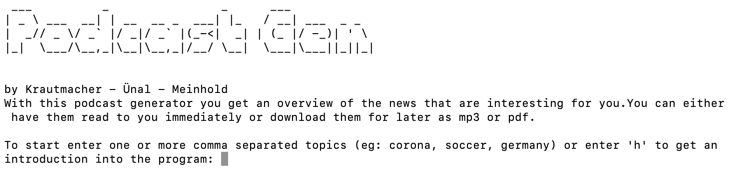

- Pascal Krautmacher [697450]
- Marco Alexander Meinhold [872406]
- Eren Ünal [859039]

The following markdown code would create a valid output. Only Pascal Krautmacher, Marco Alexander Meinhold and Eren Ünal
will evaluted for the use case.

# 002---Audio-News-Podcast-Generator

**002 - Audio News Podcast Generator, MBA HSD SS21**

**Summary**: Automated generation of a podcast from relevant news available on the internet.

### Team

#### Project Lead:

- Thomas Zeutschler

#### Data Scientist:

- Pascal Krautmacher
- Marco Alexander Meinhold
- Eren Ünal

### 1. Task

The Task was to create a command line tool, named **podgen.py** that comes with a configuration file containing a
user-editable list of news sources to be investigated. The primary news source should be public RSS or AtomFeeds, but
additional sources are also welcome. The configuration file should contain a list of at least 30 RSS feeds from popular
news sources like CNN, NYT, FoxNews, Spiegel an others. The command line tool takes a list of comma separated keywords
or phrases arguments to used (like **Corona**; **Football**) to generate and filter the podcast. Multiple search
arguments should be combined by an **AND** filter operations. It also requires a help function to assist the user in
using the tool by entering
**'podgen.py /help'** or ** 'podgen.py /h'** on Windows or respective
**'podgen.py --help'** or  ** 'podgen.py --h'** on MAc/Unix. The commandline tool displays progress and status
information while the podcast is in generation. At least, the command line tool reates an audio file (e.g. MP3), ready
for direct consumption. Note: The audio file should be created in the current folder.

To achieve this task, we proceed according to The Team Data Science Process (TDSP). This is a standardized process model
for analytics projects. Each solution section follows the process steps of the TDSP.

Proposal:
The Task was to create a command line tool, named **podgen.py** that comes with a configuration file containing a
user-editable list of news sources to be investigated. The primary news source should be public RSS or AtomFeeds, but
additional sources are also welcome. The configuration file should contain a list of at least 30 RSS feeds from popular
news sources like CNN, NYT, FoxNews, Spiegel an others. The command line tool takes a list of comma separated keywords
or phrases arguments to used (like **Corona**; **Football**) to generate and filter the podcast. It also requires a help function to assist the user in
using the tool by entering
Do we have the help option and is it working as follows?
**'podgen.py /help'** or ** 'podgen.py /h'** on Windows or respective
**'podgen.py --help'** or  ** 'podgen.py --h'** on MAc/Unix. The commandline tool displays progress and status
information while the podcast is in generation. As result the user has different options to get the output. 
1. Read it directly with given parameters
2. Save as MP3
3. Save as PDF
Note: The audio file should be created in the current folder.

To achieve this task, we proceed according to The Team Data Science Process (TDSP). This is a standardized process model
for analytics projects. Each solution section follows the process steps of the TDSP.

### 2. Business Understanding

In the course of the task, a command line tool was created that automatically generates a podcast for the user after he
enters his interests. The podcast plays the latest interesting news for the user.

So, the **goal of the task** was to create a user-friendly tool for automatic podcast generation. The tool asks the user
for their topic preferences and generates the latest news. These news items are then read aloud by the tool. In the
process, the user can set the volume, speed and language of the podcast according to his preferences. The generated
podcast can be saved according to the user's preferences.

Proposal:
In the course of the task, a command line tool was created that automatically generates a podcast for the user after he
enters his interests. The podcast plays the latest interesting news for the user.

So, the **goal of the task** was to create a user-friendly tool for automatic podcast generation. The tool asks the user
for their topic preferences and generates the latest news. These news items are then read aloud by the tool. In the
process, the user can set the volume, speed and language of the podcast according to his preferences. The generated
podcast can be saved according to the user's preferences to an MP§ file or as PDF document. 

### 3. Data Acquisition and Understanding

#### What is an RSS Feed?
An RSS feed is an up-to-date information or list of notifications that a website delivers to its subscribers. 
RSS means "rich site summary" or "really simple syndication."

An RSS feed is read by an RSS reader or a feed reader, which can be either Web based, 
a standalone desktop application or a mobile application. 
The reader aggregates all the RSS feeds that a user is subscribed to and presents them in its UI; 
this avoids the need for the user to go to each website just to read the updates.

An RSS feed is delivered in XML format, allowing maximum compatibility between readers.
Before the advent of RSS feeds, websites sent subscribers email notifications regarding new content. 
This was not optimal, however, as some emails could end up in the junk folder or mixed with other emails, 
plus the fact that the emails are formatted differently. In contrast, an RSS reader presents all the feeds using its own interface.

#### Used Python Packages:
requests 
- For xxyz
pandas
lxml
pyttsx3
feedparser
nltk
seaborn

replace
- Text processing and cleaning the output getting directly from feeds

pydub

art
- ASCII art is also known as "computer text art". 
It involves the smart placement of typed special characters or letters to make a visual shape that is spread over multiple lines of text.

progressbar
- A text progress bar is typically used to display the progress of a long running operation, 
providing a visual cue that processing is underway.

fpdf
- PyFPDF is a library for PDF document generation under Python, 
ported from PHP (see FPDF “Free”-PDF, a well-known PDFlib-extension replacement with many examples, scripts and derivatives).
Compared with other PDF libraries, PyFPDF is simple, small and versatile, with advanced capabilities and easy to learn, extend and maintain.

tqdm
- Instantly make your loops show a smart progress meter - just wrap any iterable with tqdm(iterable), and you’re done!


- Implementation is..

### 4. Modeling

- MP3
- Scrapper
- Key-Word
- txt-file .....

- Example:
    - Class: Converter
    - Explanation: text........


    def __init__(self, rate:int=150, volume:int=100, language:str="english"):
        self.text = ""
        self.rate = rate
        self.volume = volume
        self.language = language

        engine.setProperty('rate', self.rate)
        engine.setProperty('volume', self.volume)
        engine_voice = self.language
        if engine_voice == "english":
            voice_gender = input("Do you want a male or a female voice? (Type: male or female)")
            if voice_gender == "male":
                engine.setProperty('voice', "com.apple.speech.synthesis.voice.Alex")
            else:
                engine.setProperty('voice', "com.apple.speech.synthesis.voice.Victoria")
        else:
            engine.setProperty('voice', "com.apple.speech.synthesis.voice.anna.premium")

    def speak(self, text:str):
        engine.say(text)
        engine.runAndWait()

    def save_as_mp3(self, text:str, file_name:str = "podcast.mp3"):
        engine.save_to_file(text, file_name)
        engine.runAndWait()

- Learnings: text.......

1. Class: Converter()
- Task: The Converter class includes the functions to read out the podcast, save it as mp3 and save it as pdf. Also, the class includes the setting of the speed, the rate and the language of the podcast. 
- Functions:
  - def init: The init function initiates the class and sets the parameters (volume, rate and speech). 
  - def speak: The speak function reads out the podcast with the previously set parameters.  
  - def save_as_mp3: 
    - Code:
      ```
        text = text.replace(".", ", ")
        engine.save_to_file(text, file_name)
        engine.runAndWait()
      ```
    - The save_as_mp3 function saves the podcast as an mp3 file on the user's disk so that the user can access it offline. 
    - Problem: While creating the mp3 file, the problem appeared that the mp3 was stopped after the first dot. We fixed this by replacing all the dots with commas.This still leaves a pause when speaking and the text is read aloud completely.
  - def save_as_pdf: 
    - The save_as_pdf function saves the podcast as a pdf file to the user's hard disk so that the user can read it offline.
    - Problem: It is problematic to save the text as utf-8, because it contains special characters that can only be captured by latin-1 (uses the fpdf package). So text has to be encoded in latin-q beforehand
    - Code:
      ```
        text_encoded = text.encode('latin-1', 'replace').decode('latin-1')
        text = text_encoded.replace("?", ".").replace("[", "").replace("]", "").replace("'", "")

        a4_width_mm = 210
        pt_to_mm = 0.35
        fontsize_pt = 10
        fontsize_mm = fontsize_pt * pt_to_mm
        margin_bottom_mm = 10
        character_width_mm = 7 * pt_to_mm
        width_text = a4_width_mm / character_width_mm

        pdf = FPDF(orientation='P', unit='mm', format='A4')
        pdf.set_auto_page_break(True, margin=margin_bottom_mm)
        pdf.add_page()
        pdf.set_font(family='Courier', size=fontsize_pt)
        splitted = text.split('\n')

        for line in splitted:
            lines = textwrap.wrap(line, width_text)

            if len(lines) == 0:
                pdf.ln()

            for wrap in lines:
                pdf.cell(0, fontsize_mm, wrap, ln=1)

            pdf.output(file_name, 'F')
            print(text)```
- Learnings:

```
shell
```

### 5. Achievements

- Summary, if the target have been archived
- What are the optimization potentials of the program? What were the problems?
    - Nicht nur nach KeyWord suchen sondern auch nach Synoymen oder zugehörigen Themen

### 6. Display the Process

Example:


### Outlook future/ Reference

> enjoy your individual podcasts!