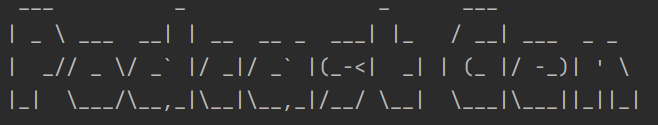
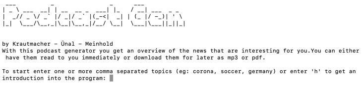
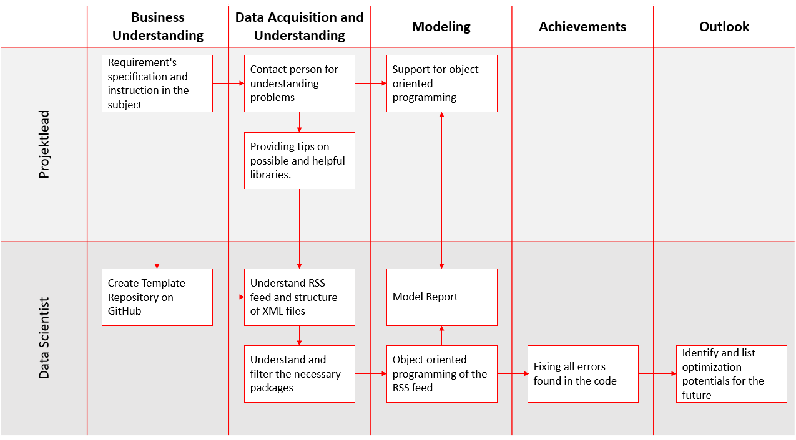
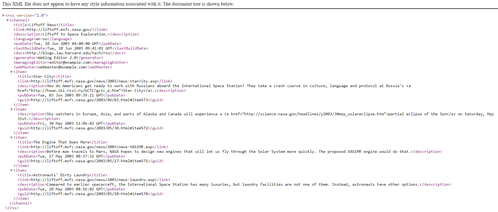

- Pascal Krautmacher [697450]
- Marco Alexander Meinhold [872406]
- Eren Ünal [859039]
- Thomas Zeutschler

The following Markdown code would create a valid output. Only Pascal Krautmacher, Marco Alexander Meinhold and Eren Ünal
will evaluate for the use case.

<a href="https://github.com/pascalkrautm/002---Audio-News-Podcast-Generator"></a>
[](https://www.python.org/)
<a href="https://github.com/pascalkrautm/002---Audio-News-Podcast-Generator"></a>
<a href="https://github.com/pascalkrautm/002---Audio-News-Podcast-Generator"></a>

# 002---Audio-News-Podcast-Generator

**002 - Audio News Podcast Generator, MBA HSD SS21**
[](https://)

**Summary**: Automated generation of a podcast from relevant news available on the internet.

### Team

#### Project Lead:

- Thomas Zeutschler

#### Data Scientist:

- Pascal Krautmacher
- Marco Alexander Meinhold
- Eren Ünal

#### Project period

- Start date: 25.04.2021
- End date: 13.08.2021



***

### Table of Contents

1. [Task](#1-task)
2. [Working Process](#2-working-process)
3. [Business Understanding](#3-business-understanding)
4. [Data Acquisition and Understanding](#4-data-acquisition-and-understanding)
5. [Modeling](#5-modeling)
6. [Achievements](#6-achievements)
7. [Display the Process](#7-display-the-process)
8. [Outlook](#8-outlook)
9. [Summary](#9-summary)

***

### Installation

A little intro about the installation:

```
$ git clone https://github.com/pascalkrautm/002---Audio-News-Podcast-Generator.git
$ cd ../path/to/the/file
$ npm install
$ npm start
```

If you don't find the directory just search for "Podcast Generator" on your computer.

Running the application:

- Start the console on your computer and go to the path of installation
- Type in python podgen.py
- Maybe there are packages not yet installed (error: package XY not found)
- install necessary packages via pip install XY
- run podgen again



Feel free to type `h` for support while using first time.

***

### 1. Task

The task was to create a commandline tool called **podgen.py** which comes with a configuration file containing a
user-editable list of news sources to be investigated. The primary news sources should be a public RSS or Atom feeds,
but additional sources are also welcome. The configuration file should contain a list of at least 30 RSS feeds from
popular news sources like CNN, NYT, FoxNews, Spiegel and others. The commandline tool takes a list of comma separated
keywords (like **Corona**, **Football**) to filter different feeds and create content for the podcast. It additionally
includes a help function to assist the user in using the tool. The commandline tool displays progress and status
information while the podcast is in generation. As result, the user has different options to receive the output:

1. Read it directly with given parameters
2. Save as MP3
3. Save as PDF Note: The audio file should be created in the current folder.

***

### 2. Working Process

To achieve this task, we proceed according to the idea of the Team Data Science
Process ([TDSP](https://docs.microsoft.com/en-us/azure/architecture/data-science-process/overview)). This is a
standardized process model for analysis projects. Since we cannot comply with all components of the TDSP within the
scope of our analysis project, such as deployment or acceptance, we solely oriented ourselves to the TDSP.

The process steps in this project have been illustrated for clarity:



Microsoft Teams and GitHub were used to communicate with each other. In GitHub, the conversation can be followed on the
basis of the [issues](https://github.com/pascalkrautm/002---Audio-News-Podcast-Generator/projects/1). The weekly
meetings via Microsoft Teams can be followed up on the basis of the issues created.

You will find all necessary information in this readme. Please clone the repository before using the app.

***

### 3. Business Understanding

During the task, a commandline tool was created which automatically generates a podcast for the user after the user
after he indicated his interests. The podcast plays the latest news tailored to the user's interests.

Thus, the **goal of the task** was to create a user-friendly tool for automatic podcast generation. The tool queries the
user´s topic preferences and generates the latest news accordingly. These news items are then read aloud by the tool. In
the process, the user can set the volume, rate and language of the podcast according to his preferences. The generated
podcast can be saved as a mp3 file or as a pdf document.

***

### 4. Data Acquisition and Understanding

#### What is an RSS Feed?

An RSS feed is up-to-date information or list of notifications that a website delivers to its subscribers. RSS means "
rich site summary" or "really simple syndication."

An RSS feed is read by an RSS reader or a feed reader, which can be either web-based, a standalone desktop application
or a mobile application. The reader aggregates all the RSS feeds that a user is subscribed to and presents them in its
UI; this avoids the need for the user to go to each website just to read the updates.

An RSS feed is delivered in XML format, allowing maximum compatibility between readers. Before the introduction of RSS
feeds, websites sent subscribers email notifications regarding new content. However, this is not optimal as some emails
end up in the junk folder or are mixed with other emails, plus the fact that the emails are formatted differently. In
contrast, a Rss reader presents all content on their feeds using its own interface.

#### What is an XML-File?

As already mentioned, RSS is based on an XML file. An XML file, which is an extensible markup language file, is used to
structure data for the purpose of storage and transport. An XML file consists of tags such as `<title>` and the text
behind it. The tags are used to reflect the data structure while the text is to be stored. The texts in an XML file are
surrounded by tags, which must correspond to different syntax guidelines. The bottom line is that the XML file is a text
file with user-defined tags that describe the document structure and specify how the data is to be stored and
transported.

<ins>For example, an XML file looks like this:</ins>

In this example we have the `<channel>` tag, which contains several sub-elements or tags.

The tags are listed and explained below:

- title = channel name of the rss feed
- link = URL of the channel/ HTML website
- description = describe the channel
- language = the language of the channel. In this case, the information on the channel is in English, as 'en-us'.
- pubDate = date on which the content was published
- lastBuildDate = last day on which the content was updated
- docs = Reference to the used documentation format of the RSS file by the URL
- generator = a string indicating the program used to generate the channel
- managingEditor = email address for person responsible for editorial content
- Webmaster = email address for person responsible for technical issues relating to channel
- item
    - title = the title of the item
    - link = the URL of the item
    - description = the description of the item
    - pubDate = indicates when the item was published
    - guid = a string that uniquely identifies the item

As part of the scraper, the desired tags are given as arguments, so that only the text behind the respective tag is
filtered out of the XML file. See here: [get_feed_data](#5-modeling).

#### Used Python Packages:

The used packages are all already listed in the [requirements](code/requirements.txt) and only need to be installed. For
ease of reference, however, these are listed separately and briefly explained in the following. If you click on the
respective package, you will automatically be redirected to the documentation of the respective package.

[pyttsx3](https://pypi.org/project/pyttsx3/)

- Text to Speech (TTS) library for Python 2 and 3. Works without internet connection or delay. Supports multiple TTS
  engines, including Sapi5, nsss, and espeak.

[feedparser](https://pypi.org/project/feedparser/)

- Feedparser is a Python library that parses feeds in all known formats, including. Atom, RSS, and RDF. It runs on
  Python 2.4 all the way up to 3.3.

[replace](https://pypi.org/project/replace/)

- Text processing and cleaning the output getting directly from feeds

[pydub](https://pypi.org/project/pydub/)

- pydub is a Python library to work with only . wav files. By using this library we can play, split, merge, edit our .
  wav audio files.

[art](https://pypi.org/project/art/)

- ASCII art is also known as "computer text art". It involves the smart placement of typed special characters or letters
  to make a visual shape that is spread over multiple lines of text.

[progressbar](https://pypi.org/project/progressbar/)

- A text progress bar is typically used to display the progress of a long-running operation, providing a visual cue that
  processing is underway.

[fpdf](https://pypi.org/project/fpdf/)

- PyFPDF is a library for pdf document generation under Python, ported from PHP (see FPDF “Free”-PDF, a well-known
  PDFlib-extension replacement with many examples, scripts and derivatives). Compared with other PDF libraries, PyFPDF
  is simple, small and versatile, with advanced capabilities and easy to learn, extend and maintain.

[tqdm](https://pypi.org/project/tqdm/)

- Instantly make your loops show a smart progress meter - just wrap any iterable with tqdm(iterable), and you’re done!

#### RSS Feeds used recently

- http://feeds.bbci.co.uk/news/world/rss.xml,
- https://rss.nytimes.com/services/xml/rss/nyt/World.xml,
- https://www.globalissues.org/news/feed,
- http://rss.cnn.com/rss/edition_world.rss,
- http://feeds.washingtonpost.com/rss/world,
- https://www.cnbc.com/id/100727362/device/rss/rss.html,
- http://abcnews.go.com/abcnews/internationalheadlines,
- https://www.cbsnews.com/latest/rss/world,
- http://feeds.skynews.com/feeds/rss/world.xml,
- https://www.rand.org/topics/international-affairs.xml/feed,
- https://www.vox.com/rss/world/index.xml,
- https://feeds.npr.org/1004/rss.xml,
- https://sputniknews.com/export/rss2/world/index.xml,
- https://www.latimes.com/world/rss2.0.xml,
- https://www.independent.co.uk/news/world/rss,
- https://www.euronews.com/rss?level=theme&name=news,
- https://www.ctvnews.ca/rss/world/ctvnews-ca-world-public-rss-1.822289,
- https://www.scmp.com/rss/91/feed, https://feeds.24.com/articles/news24/World/rss,
- https://rss.csmonitor.com/feeds/world,
- https://www1.cbn.com/app_feeds/rss/news/rss.php?section=world&mobile=false&q=cbnnews/world/feed,
- https://feeds.thelocal.com/rss/es,
- https://stardiapost.com/feed,
- https://internetprotocol.co/rss/,
- https://www.spiegel.de/international/index.rss,
- https://news.yahoo.com/rss/,
- https://thewest.com.au/business/rss,
- https://thewest.com.au/news/world/rss,
- https://thewest.com.au/sport/rss,
- https://thewest.com.au/politics/rss,
- https://rss.weatherzone.com.au/?u=12994-1285&news=1,

***

### 5. Modeling

By executing the podgen.py, you can start with the podcast generator. Nevertheless, in the following all, classes are
briefly listed and the essential explanation aspects are highlighted:

<ins>1. Class: **Main()**

- <ins>Task</ins>: Main functionality of the app.

The first part provides the design of the terminal app. The goal here is to make the commandline tool more
user-friendly.

    print(text2art('''Podcast Gen''', font="small"))  # Multi-line print
    print("by Krautmacher - Ünal - Meinhold ")
    print("With this podcast generator you get an overview of the news that are interesting for you. "
      "You can either have them read to you immediately or download them for later as mp3 or pdf. ")
    print(" ")

First, the `PodcastGenerator` will be started. With the provided Keywords from class "**Helper**" it will crawl through
all URLs inside the URL list. If the number of podcast with entries > 0, it will start the user input from class
"**Helper**" to decide the further steps.

    def main():
        while True:
            try:
                generator = PodcastGenerator()
                keywords = Helper.get_keyword()
                number_of_podcast = generator.generate_podcast(keywords)
                if number_of_podcast > 0:

If the podcasts with entries > 0, the user is first asked if he wants to have the entries read out loud or if he wants
to save it as pdf or as mp3 to be able to refer to it at a later point of time.

If the user enters `r` and thus selects the reading out of the entries, the reading sequence is started.

                while True:
                    read_or_save = Helper.ask_read_or_save()
                    if read_or_save == "r":
                        mp3_converter = Converter()
                        mp3_converter.parameter_settings()
                        mp3_converter.speak(generator.text)
                        print("Thank you for using the Podcast Generator. We hope to see you soon!")
                        break

If, on the other hand, the user selects `m` and thus saves as mp3, mp3 saving is started and a file name is requested.

                    if read_or_save == "m":
                        mp3_converter = Converter()
                        mp3_converter.parameter_settings()
                        mp3_file_name = Helper.ask_name_mp3()
                        mp3_converter.save_as_mp3(generator.text, f"{mp3_file_name}.mp3")
                        print("Thank you for using the Podcast Generator. We hope to see you soon!")
                        break

If the user types `p` to select save as pdf, the pdf saving will start and creation of a file name is requested.

                    if read_or_save == "p":
                        pdf_file_name = Helper.ask_name_pdf()
                        mp3_converter = Converter()
                        mp3_converter.save_as_pdf(generator.text, f"{pdf_file_name}.pdf")
                        print("Thank you for using the Podcast Generator. We hope to see you soon!")
                        break

                    else:
                        print(r"Your answer may not comply, please note that you may only press 'r', 'm' or 'p'.")

If no podcasts are found, only the following records will be printed. The user must manually restart or run the process
at this point. If errors which we have not currently identified occur, we have written a while error loop so as not to
interrupt the program flow.

                else:
                    print(f"No podcast with Keyword {keywords} found.")
                break
            except AttributeError:
                print("Ups an error has occurred. Please try another keyword.")    
    
    if __name__ == "__main__":
        main()

<ins>2. Class: **PodcastGenerator()**

- <ins>Task</ins>: This class provides the content of RSS pages based on user-defined topics. It searches the XML files
  for appropriate information and prepares the output in a readable format for further processing.

The generator first divides the URL list into different sources of RSS feeds. Our URL list includes well-known
newsletters such as BBC, Skynews, Yahoo, CNN, NYT, FoxNews and others. The list can be found
here: [url_list](code/url_list.txt)

    file = open("url_list.txt", "r")
    self.content = file.read()
    self.url_list = self.content.split(",")

`get_feed_data` scans every URL in the list and searches for the keyword (user input: find details in class
"**Helper**"). If the title contains one of the keywords, the summary of the article is stored in a list. This list is
adjusted for readable and necessary content. We go there and only pull out the pure text on the respective day. This
means, for example, that we extract only the plain text from the tags `<summary>` or `<published>` and remove the
special characters. In addition, we add “New Item”, “Date” and “Source” to ensure clarity

        def get_feed_data(self):
            """
            Create a List with all articles that include the keywords.
            :return: List with all article that include the keywords
            """
            ssl._create_default_https_context = ssl._create_unverified_context
            ticks = len(self.url_list)
            with tqdm(total=ticks, leave=False) as progress_bar:
                progress_bar.set_description("Scraping")
                counter = 0
    
                # rss_feed_scrapper
                for url in self.url_list:
                    feed = feedparser.parse(str(url))
                    # delete entries_len not in use?
                    len(feed.entries)
    
                    for entry in feed.entries:
                        for keyword in self.keywords:
                            if str(keyword) in entry.title.lower():
                                clean_summary = re.sub("(<.*?>)", "", entry.summary, 0, re.IGNORECASE | re.DOTALL |
                                                       re.MULTILINE)
                                                            try:
                                pubdate = entry.published
                            except:
                                pubdate = ""

                                self.feeds.append(
                                    "New Article: " + feed.feed["title"] + " " + entry.published[3:17] + ", "
                                    + entry.title + ". " + clean_summary)
                                self.number_of_posts += 1
    
                    for i in range(len(self.feeds)):
                        self.feeds[i] = self.feeds[i].lower()
    
                    counter += 0.5
                    progress_bar.update(counter)
                progress_bar.update(ticks)
                print("Scraping done! Process finished: 100%")

In this function, a progressbar was implemented to show the scrapping progress to users.

The function `clean_data `cleans the data from noise for the export. Noise includes special characters which will
disturb the speech output later. Such characters are tags from HTML as well as false punctuation. As result of this
class, an output in txt format will be generated.

        def clean_data(self, save_to_disc: bool = False):
            """
            Cleans feed data for reading.
            :return: the cleaned text, ready for reading
            """
            feeds_clean = str(self.feeds)
            feeds_clean = feeds_clean.replace("</p>'", " ").replace("<p>", ".").replace("<h1>", " ").replace("</h1>", " ")\
                .replace("</p>", " ").replace("<hr />.", " ")
            return feeds_clean

3. <ins>Class: **Helper()**

- <ins>Task</ins>: supports the main functions and gets every user input

`print_help `provides the user with the manual instructions when he enters `h`instead of keywords. The manual
instructions are listed together using a for loop to give users better clarity.

    @staticmethod
        def print_help():
        """Returns the help description"""
            helper_description = ("",
                              "To generate the RSS feed, you need to answer several questions."
                              "Below, you can find these questions including their purpose for clarification and "
                              "understanding:",
                              "-In the first step, you need to enter your desired topics so that the current program"
                              " can search the internet according to your entered interests.",
                              "-You will then be asked whether you want the news to be generated as a pdf, an mp3 or"
                              " voice-speak. If you choose the pdf or mp3 option, please note that the result will"
                              " be saved in the 'code' folder. If you decide for pdf, there is nothing more to do, "
                              " accept entering the name you wish for you file. ",
                              "-If you use the mp3 or voice-speak option there are further questions to consider."
                              " You have to set the voice rate, language and volume for your output. "
                              " You will be asked if you want to use the default settings. "
                              " Note: When you start the program for the first time, please enter your "
                              " desired parameters. Otherwise the program will start with the default parameters "
                              "set by us. You can change the parameters at any time according to your preferences. If "
                              "you decide for mp3, there is nothing more to do, accept entering the name you wish for "
                              "you file.", 
                              "")
            for value in helper_description:
                print(value)

`get_keyword `provides the user input as topics to the PodcastGenerator. Additionally, the previous class is implemented
to this function. This will provide the manual to the user when typing `h` instead of any topic. After the user typed in
his keywords, this function will split all inputs with commas "," to prepare them for crawling through feeds. In
addition it will check if there is an empty input and asks the user for valid input. Without checking this it would
provide all news from RSS source.

    @staticmethod
    def get_keyword():
        """
        Ask for keywords or helper.
        :return: List of keywords.
        """
        keyword = str(input("To start enter one or more comma separated topics (eg: corona, soccer, germany) or enter "
                            "'h' to get an introduction into the program: "))

        while keyword == "":
            print("Please enter valid keywords!")
            keyword = str(input("To start enter one or more comma separated topics (eg: corona, soccer, germany)or enter "
                            "'h' to get an introduction into the program: "))
            while keyword == "h":
                Helper.print_help()
                keyword = str(
                    input("To start enter one or more comma separated topics (eg: corona, soccer, germany)or enter "
                          "'h' to get an introduction into the program: "))

        keywords = keyword.lower().replace(" ", "").split(",")
        print(f"Given topics are {keywords}")
        return keywords

Following functions will ask the user fo his parameters used inside speech part. These parameters can be saved and
automatically used for the next run. Please note that in the first run of the program, there are no parameters for the
system. Therefore, the system works with the parameters we have preset and unless any information is given, parameters
can be:

- Voice rate
- Voice volume
- Voice language ( at this moment only German and English )
- Voice gender

You will also find the questions for reading or saving in mp3 or pdf in this part.

    @staticmethod
    def ask_parameters():
        return input(
            "Would you like to use the default settings (voice rate, language, volume) for the Podcast?"
            "(Type 'y' for yes or 'n' for no.)")

    @staticmethod
    def get_voice_rate():
        return input("Please select a voice rate between 100 and 200 (Recommendation = 150).")

    @staticmethod
    def get_voice_volume():
        return input("Please select the volume between 0 and 1.0 (Recommendation = 1.0).")

    @staticmethod
    def get_voice_language():
        return input("Please select german or english as language (Type 'g' for german or 'e' for english).")

    @staticmethod
    def get_voice_gender():
        return input("Please select the speakers gender (Type 'm' for male or 'f' for female).")

    @staticmethod
    def ask_to_save_parameter():
        return input("Do you like to save the parameter you have entered as new standard parameters "
                     "for the next time? (y/n)")

    @staticmethod
    def ask_read_or_save():
        return input(
            "Please select whether you want the podcast to be read aloud (r) now, saved as an mp3 (m) for later, "
            "or saved as a pdf (p) for later (r/m/p).")

    @staticmethod
    def ask_name_mp3():
        return input("What name should the mp3-file have? (Please do not type '.mp3' after the name)")

    @staticmethod
    def ask_name_pdf():
        return input("What name should the pdf-file have? (Please do not type '.pdf' after the name)")

4. <ins>Class: **Converter()**

- <ins>Task</ins>: Supports the main functions. The converter class includes the functions to read out the podcast, save
  it as mp3 and save it as pdf. Additionally, the class includes the setting of the rate, the volume and the voice of
  the podcast. Additionally the Class separates Windows-User and MacOS-User because it is necessary to provide different
  language setting. MacOS uses e.g. the `"com.apple.speech.synthesis.voice.anna.premium"`. Windows User need to specify
  the local language settings
  like `"HKEY_LOCAL_MACHINE\\SOFTWARE\\Microsoft\\Speech\\Voices\\Tokens\\TTS_MS_DE-DE_HEDDA_11.0")`.

With `parameter_settings` the user's specifications are considered in the program. Several while loops are coded here to
warn the user, if he enters information that is not within the definition range and thus cannot be processed by the
program. At this point, however, the user is prompted again to enter the information correctly. If the user answers,
whether he wants to use the default settings with `n`, he must enter his desired parameters (=rate, volume)
in the context of the queries. After the user has specified the rate and volume, he is asked for the desired language.
If the user selects `e` and thus English, he has the option to choose between a female `f` and male `m` voice. If, on
the other hand, the user selects `g` and thus the German language, a female voice is used by default.

    def parameter_settings(self):
        """
        Set the parameters for read or save as mp3
        :return: Parameters are set
        """
        while True:
            engine_parameters = Helper.ask_parameters()
            if engine_parameters == "n":
                self.rate = Helper.get_voice_rate()
                engine.setProperty("rate", self.rate)
                self.volume = Helper.get_voice_volume()
                engine.setProperty("volume", self.volume)
                while True:
                    self.language = Helper.get_voice_language()
                    if self.language == "e":
                        while True:
                            self.gender = Helper.get_voice_gender()
                            if self.gender == "m":
                                if platform.system() == "Darwin":
                                    engine.setProperty("voice", "com.apple.speech.synthesis.voice.Alex")
                                else:
                                    engine.setProperty("voice",
                                                       "HKEY_LOCAL_MACHINE\\SOFTWARE\\Microsoft\\Speech\\Voices\\"
                                                       "Tokens\\TTS_MS_EN-US_DAVID_11.0")
                                break
                            if self.gender == "f":
                                if platform.system() == "Darwin":
                                    engine.setProperty("voice", "com.apple.speech.synthesis.voice.Victoria")
                                else:
                                    engine.setProperty("voice",
                                                       "HKEY_LOCAL_MACHINE\\SOFTWARE\\Microsoft\\Speech\\Voices\\"
                                                       "Tokens\\TTS_MS_EN-GB_HAZEL_11.0")
                                break
                            else:
                                print(r"Your answer may not comply, please note that you may only press 'm' or 'f'")
                        break
                    if self.language == "g":
                        if platform.system() == "Darwin":
                            engine.setProperty("voice", "com.apple.speech.synthesis.voice.anna.premium")
                        else:
                            engine.setProperty("voice",
                                               "HKEY_LOCAL_MACHINE\\SOFTWARE\\Microsoft\\Speech\\Voices\\"
                                               "Tokens\\TTS_MS_DE-DE_HEDDA_11.0")
                        break

As soon as the user has completely answered all the questions about the parameters, the program asks him whether he
wants to save them for the next session. If the user chooses `y` and thus to save, the file **parameters.pkl** is
created in the background, which the program then accesses next time. If, on the other hand, the user chooses `n` and
thus does not want to save, the program already begins with the next query.

                while True:
                    engine_save_parameter = Helper.ask_to_save_parameter()
                    if engine_save_parameter == "y":
                        # create a list with our default parameters
                        save_parameters = [self.rate, self.volume, self.language, self.gender]
                        # save our list for next session
                        open_file = open("parameters.pkl", "wb")
                        pickle.dump(save_parameters, open_file)
                        open_file.close()
                        break
                    if engine_save_parameter == "n":
                        pass
                        break
                    else:
                        print(r"Your answer may not comply, please note that you may only press 'y' or 'n'")

If the user decides to use the already entered parameters again and thus types `y`, the program will fetch the
corresponding parameters from the parameters.pkl file. If the user starts the program for the first time and still
selects `y` at this point, the program will run with the parameters we have already preset. At this moment it will be
the english voice male with 150 rate and 1.0 volume.

            if engine_parameters == "y":
                try:
                    # load saved parameters from last session
                    open_file = open("parameters.pkl", "rb")
                    parameter_list = pickle.load(open_file)
                    open_file.close()
                    voice_rate_default = parameter_list[0]
                    voice_volume_default = parameter_list[1]
                    voice_language_default = parameter_list[2]
                    voice_gender_default = parameter_list[3]
                    engine.setProperty("rate", voice_rate_default)
                    engine.setProperty("volume", voice_volume_default)
                    if voice_language_default == "e":
                        if voice_gender_default == "m":
                            if platform.system() == "Darwin":
                                engine.setProperty("voice", "com.apple.speech.synthesis.voice.Alex")
                            else:
                                engine.setProperty("voice",
                                                   "HKEY_LOCAL_MACHINE\\SOFTWARE\\Microsoft\\Speech\\Voices\\"
                                                   "Tokens\\TTS_MS_EN-US_DAVID_11.0")
                        if voice_gender_default == "f":
                            if platform.system() == "Darwin":
                                engine.setProperty("voice", "com.apple.speech.synthesis.voice.Victoria")
                            else:
                                engine.setProperty("voice",
                                                   "HKEY_LOCAL_MACHINE\\SOFTWARE\\Microsoft\\Speech\\Voices\\"
                                                   "Tokens\\TTS_MS_EN-GB_HAZEL_11.0")
                    if self.language == "g":
                        if platform.system() == "Darwin":
                            engine.setProperty("voice", "com.apple.speech.synthesis.voice.anna.premium")
                        else:
                            engine.setProperty("voice",
                                               "HKEY_LOCAL_MACHINE\\SOFTWARE\\Microsoft\\Speech\\Voices\\"
                                               "Tokens\\TTS_MS_DE-DE_HEDDA_11.0")
                except IOError:
                    engine.setProperty("rate", 200)
                    engine.setProperty("volume", 1.0)
                    if platform.system() == "Darwin":
                        engine.setProperty("voice", "com.apple.speech.synthesis.voice.Alex")
                    else:
                        engine.setProperty("voice",
                                           "HKEY_LOCAL_MACHINE\\SOFTWARE\\Microsoft\\Speech\\Voices\\"
                                           "Tokens\\TTS_MS_EN-US_DAVID_11.0")
                break
            else:
                print(r"Your answer may not comply, please note that you may only press 'y' or 'n'")

With `speak` the commandline reads out the podcast with the parameters set previously.

    def speak(self, text: str):
        """
        Read aloud the cleaned text based on the set parameters
        :return: Reads cleaned text aloud
        """
        engine.say(text)
        engine.runAndWait()

The `save_as_mp3` function saves the podcast as a mp3 file on the user's disk so that the user can access it offline.

    def save_as_mp3(self, text: str, file_name: str = "Podcast.mp3"):
        """
        Saves the cleaned text as mp3 based on the set parameters.
        :return: mp3-file
        """
        text = text.replace(".", ", ")
        engine.save_to_file(text, file_name)
        engine.runAndWait()

The `save_as_pdf` function saves the podcast as a pdf file so that the user can access it offline. To change the pdf,
the user can set the page orientation, user unit and format
within [FPDF](https://pyfpdf.readthedocs.io/en/latest/reference/FPDF/index.html). Furthermore, it is possible to set the
bottom page margin using [set_auto_page_break](http://www.fpdf.org/en/doc/setautopagebreak.htm).
With [set_font](https://pyfpdf.readthedocs.io/en/latest/reference/set_font/index.html) the font and font size can be
set.

    def save_as_pdf(self, text: str, file_name: str = "Podcast.pdf"):
        """
        Saves the cleaned text as pdf based on the set parameters.
        :return: pdf-file
        """
        text_encoded = text.encode('latin-1', 'replace').decode('latin-1')
        text = text_encoded.replace("?", ".").replace("[", "").replace("]", "").replace("'", "")

        pdf = FPDF(orientation='P', unit='mm', format='A4')
        pdf.set_auto_page_break(True, margin=10)
        pdf.add_page()
        pdf.set_font(family='Courier', size=12)
        splitter = text.split('\n')

        for line in splitter:
            lines = textwrap.wrap(line, 75)
            if len(lines) == 0:
                pdf.ln()
            for wrap in lines:
                pdf.cell(0, 4, wrap, ln=1)
            pdf.output(file_name, 'F')

***

### 6. Achievements

All requirements are fulfilled in first launch. The app can be used and produces output which meet the required
functions mentioned in the task description. Nevertheless, there were a few problems on the way which we had to deal
with. You will find all problems with the respective solutions below. Eventually, they can function as support for
further development.

#### Problems we had to deal with:

- <ins>Code stops when no entry.published is found</ins><br>
  There are some entries without published date. This app will read this tag and also provide it as output. Entries
  without this date will result in error and no podcast will be provided. We solve this problem by checking if there
  exists a tag named "published" and if not provide it as ""

```                         
try:
  pubdate = entry.published
except:
  pubdate = ""

self.feeds.append("New Article: " + feed.feed["title"] + " " + pubdate[3:17] + ", "
                    + entry.title + ". " + clean_summary)
self.number_of_posts += 1
```

- <ins>Separate MacOS user from Windows user</ins><br>
  One main problem was the difference between both operating system due to difference language settings. The apple
  speech support does not work on Windows operating systems. To solve this problem we implemented a loop to check the
  operating system and provide the corresponding speech settings.

``` 
if platform.system() == "Darwin":
  engine.setProperty("voice", "com.apple.speech.synthesis.voice.Victoria")
else:
  engine.setProperty("voice","HKEY_LOCAL_MACHINE\\SOFTWARE\\Microsoft\\Speech\\Voices\\"
                             "Tokens\\TTS_MS_EN-GB_HAZEL_11.0")
```

- <ins>Getting the right data while scrapping</ins><br>
  Different RSS feeds, different tags and name. Not all RSS feeds looks the same. So ist was a challenge to get a
  universal scraper, that gets the right data. In the end we have challenged it. Please find more details in
  section [Data Acquisition and Understanding](#4-data-acquisition-and-understanding).


- <ins>Helper:</ins><br>
  The goal was to create a user-friendly way to use the app. Therefore, the first step was to create a process to guide
  the user through the process. This process has to be easy, so that anybody will be able to use the app without
  questions at the first run. After the process was created, we additionally add a helper function to guide the user. It
  is possible to call these function by typing `h` with the first answer the user can provide.


- <ins>" " in User input:</ins><br>
  The app should only search for the word in user input. First, it takes every character, including empty spaces. As
  result, words needed to have a space before they start when the user types a space. The user input was cleaned from
  noise (such as spaces) to retrieve the word only.

`keywords = keyword.lower().replace(" ", "").split(",")`

- <ins>Capitalization</ins> <br>
  One big problem was the letter structure of the user input. "Corona" should be the same as "corona". These words are
  not the same while working with Python. Thus, we implemented the transformation of every word in small letters. For
  the pdf file, we had to use another output because for reading, it is necessary to get capital letters as well.

`keyword.lower()
`

- <ins>Cleaning up the output:</ins> <br>
  Additionally, the cleaning part for the speaking represents a big problem we had to deal with. Code loaded directly
  from RSS page is full of tags and special characters, also called noise. We had to clean everything, except the part
  we really needed for the speaking, writing or mp3 output.

`feeds_clean = feeds_clean.replace("</p>'", " ").replace("<p>", ".").replace("<h1>", " ").replace("</h1>", " ") \
.replace("</p>", " ").replace("<hr />.", " ")
`

- <ins>Creating MP3 file</ins> <br>
  While creating the mp3 file, the problem appeared that the mp3 was stopped after the first dot. We fixed this by
  replacing all the dots with commas. This causes a break when speaking and the text is read out loud completely.

`text = text.replace(".", ", ")`

- <ins>Creating pdf file:</ins> <br>
  It is problematic to save the text as utf-8 because it contains special characters that can only be captured by
  latin-1 (uses the fpdf package). Therefore, the text must be encoded in latin-1 beforehand. Another problem was that
  when the pdf file was created, a paragraph was made for each letter in the pdf file. We solved that problem by
  splitting the feed entries beforehand with `('\n')` and then using a for loop to apply the
  module [textwrap.wrap](https://docs.python.org/3/library/textwrap.html) to all entries. Below, you can see the process
  of creating the pdf:
    - Step 1: [test1.pdf](docs/test1.pdf)
        - Problem: In the first attempt, only one letter was displayed in each line.
    - Step 2: [test2.pdf](docs/test2.pdf)
        - Problem: Since the text was a list, some special characters were displayed that disturbed reading.
    - Final step: [testfinal.pdf](docs/testfinal.pdf)
        - Problem: Still not perfect, but the pdf is pleasant to read. For potential improvements,
          see [Outlook](#8-outlook).


- <ins>pkl file:</ins> <br>
  When the app runs the first time it asks for the default parameters to use. However, in first run there is no pkl to
  load the parameters from. As a solution, the default parameters get saved in a pkl by answering this question the
  first time. For the second run, the pkl file can be loaded by answering for the default parameters. By saving new
  parameters via input from the user, the pkl file gets overwritten and saved as default parameters for the next run.

``` 
except IOError:
  engine.setProperty("rate", 200)
  engine.setProperty("volume", 1.0)
  if platform.system() == "Darwin":
     engine.setProperty("voice", "com.apple.speech.synthesis.voice.Alex")
  else:
      engine.setProperty("voice","HKEY_LOCAL_MACHINE\\SOFTWARE\\Microsoft\\Speech\\Voices\\"
                                 "Tokens\\TTS_MS_EN-US_DAVID_11.0")
```

***

### 7. Display the Process

In the following, the entire process is presented from the point of view of the user of the application using the bpmn
notation. This illustrates the user's way through the communication. Please find notations language details
here: https://www.omg.org/spec/BPMN/2.0/


Please find all steps detailed in the class description above.

***

### 8. Outlook

There are also some topics, we would like to implement in the future:

1. <ins>User input</ins>

- Check for synonyms for the user input
- Make recommendations for keywords to search for
- Possibility to look for given topics
- Possibility to select more languages
- In addition to Rss feeds also consider Atom feeds
- Possibility to change sources via user input. At the moment you have to change the urls inside url_list

2. <ins>Set options in application</ins>

- Enter save path for the MP3 and PDF file
- Enter url to extend the url list

3. <ins>Output</ins>

- Only show new entries
- Improved formatting inside pdf file e.g. by inserting images or bulleted lists

4. <ins>Design features</ins>

- Including some more design features like web interface would be great
- Implement main menu to start with
- Use Python package to make parts better looking

***

### 9. Summary

The task was to develop a commandline tool podcast generator that creates podcasts from RSS feeds based on individual
topics. This task was solved as follows:
A sequential app was developed that guides the user through the process based on questions and inputs. The user can
specify topics by entering keywords. RSS feeds are searched based on these topics. If a topic is deemed relevant, the
article text is saved and prepared for output. Several topics from different areas can be processed in one go. The user
can then decide how the output should be done. Both the language and the format are customizable. The parameter settings
can be saved and recalled for further use. The app works on MacOS devices as well as on Windows devices. The process
flow was visualized and designed to be user-friendly as far as possible. Further areas of development are planned for
the future. A ML component for the general collection of the topic and not only the search for keywords would be
conceivable. In addition, the code can be used as a web app and supplemented with design elements on a website. With
access to user data, topic suggestions or the latest topics could also be offered. For the program flow an improvement
of the process is planned. This includes the implementation of a settingssection and a menu navigation. At this stage,
the app is fully functional and also reacts to possibly not yet known errors with a user-friendly error loop.

#### Feel free to check our tool and give us feedback! Enjoy ;) 